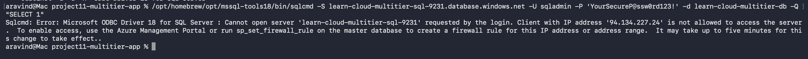
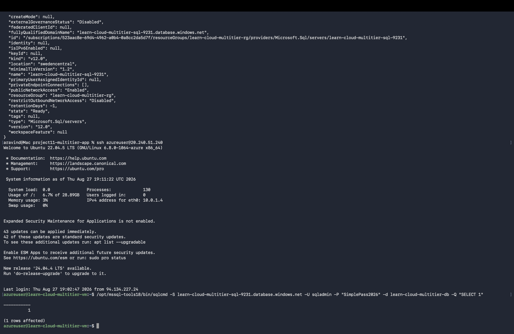

# Project 11: Multi-Tier Application with VNet Segmentation

## What this project demonstrates
A properly segmented cloud architecture where a database (data tier) is only reachable from a specific application subnet — not from the public internet — using Azure Virtual Network (VNet) rules.

## Architecture
VNet: learn-cloud-multitier-vnet (10.0.0.0/16)
│
├── app-subnet (10.0.1.0/24)
│ └── Ubuntu VM — the "application tier"
│
└── data-subnet (10.0.2.0/24)
└── (reserved for future data-tier resources)

Azure SQL Database (learn-cloud-multitier-db)
└── VNet rule: only allows connections from app-subnet

**Note on design change:** originally planned to use Azure App Service for the app tier, but pivoted to a VM after hitting a regional App Service quota restriction on this subscription. This preserves the same core lesson — segmenting an app tier from a data tier — using a different compute layer (IaaS instead of PaaS).

## What I learned
- How VNets and subnets divide a private network into isolated zones
- How Azure SQL Database's VNet rules restrict database access to specific subnets only
- Azure SQL requires a **Service Endpoint** (`Microsoft.Sql`) enabled on a subnet before that subnet can be added to a database's VNet rule allowlist
- The difference between network-layer connectivity and authentication-layer access: a basic TCP connection test (`nc`) can succeed even when a client is correctly blocked, because Azure SQL's Gateway layer always accepts the initial connection — the actual VNet-based restriction is enforced at the authentication stage, one layer deeper
- How to properly verify network segmentation with real, authenticated connection attempts from both an allowed and a disallowed location — not just checking if resources exist

## Tools used
- Azure CLI
- Azure Virtual Network (VNet) + Subnets
- Azure SQL Database + VNet rules
- Azure Virtual Machine (Ubuntu 22.04)
- sqlcmd (Microsoft ODBC tools) — for real authenticated connection testing

## Proof it works — real verification, not just resource existence

**Test 1: Connection attempt from outside the VNet (my Mac) — correctly blocked**

The error explicitly confirms the client's public IP was rejected at the authentication layer — proof the VNet rule is actively enforced, not just configured.

**Test 2: Connection attempt from inside app-subnet (the VM) — successfully authenticated and queried**

A real `SELECT 1` query returned data successfully — confirming the app tier can genuinely reach and use the database, while the outside world cannot.

## Debugging notes
- Hit `SkuNotAvailable` errors for the `Standard_B1s` VM size across three different regions before finding `Standard_B2s_v2` was actually available — a reminder that VM size availability varies by region and changes over time; always check `az vm list-skus` rather than assuming a size exists everywhere
- Hit an App Service Plan quota wall (`Total VMs: 0`) that blocked the originally planned PaaS approach entirely — pivoted the architecture rather than waiting on a support ticket

## Cost note
Used a small VM (Standard_B2s_v2) and Basic-tier SQL Database — both low-cost. Resources torn down after project completion.
